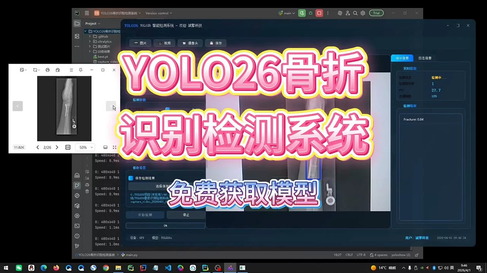
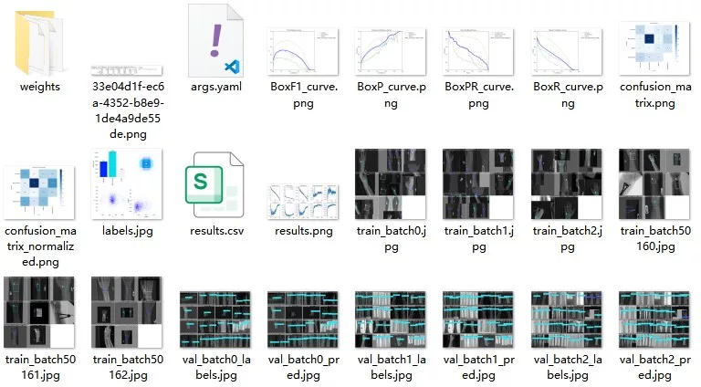
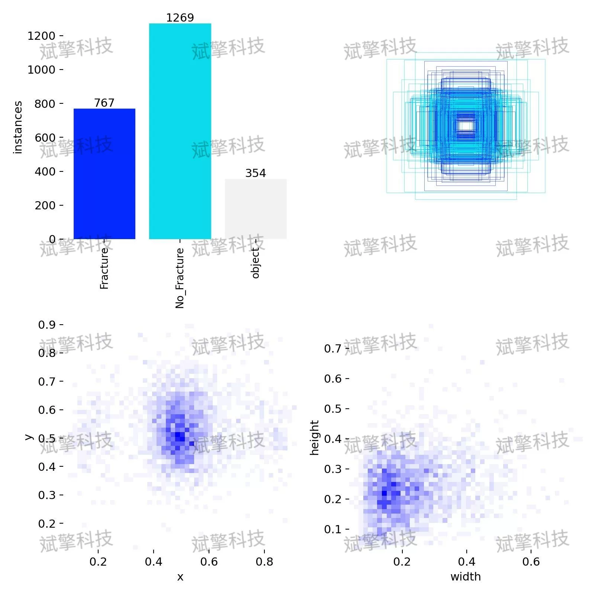
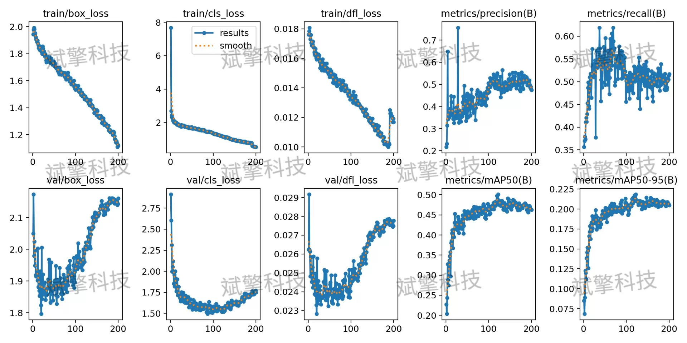
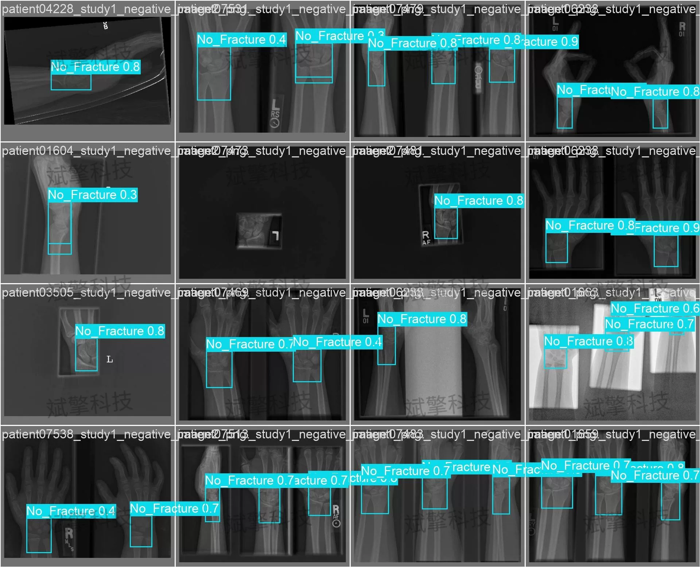
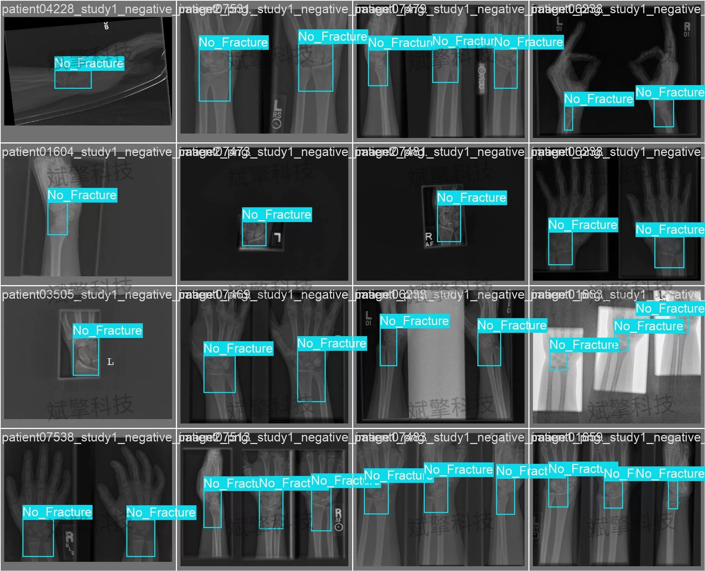
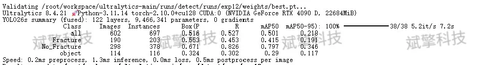
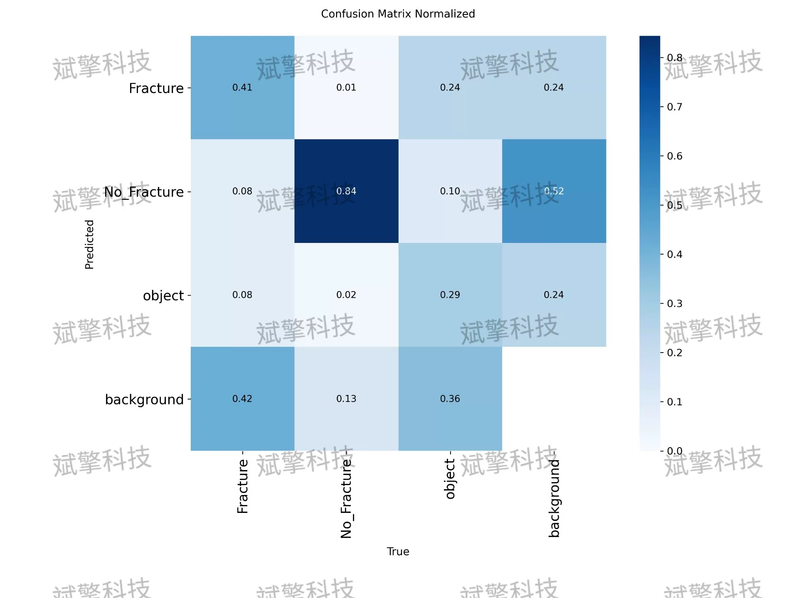

# YOLOv26 Fracture Detection System | Model + Source Code

## Body

YOLO26 Fracture Identification Detection System: A High-Precision Intelligent Diagnosis and Analysis Platform for Fracture Images Based on the YOLOv26 Object Detection Framework (Project Source Code + Dataset + Model Weights + UI Interface + Python + Deep Learning + Remote Deployment)

This study proposes a fracture identification system based on the YOLOv26 object detection framework, aiming to achieve automatic localization and classification of fracture areas in medical images through deep learning technology. The system constructs a dataset containing three categories of targets: "Fracture", "No_Fracture", and "object". It covers a total of 2108 training images, 602 validation images, and 301 test images. This study provides preliminary technical validation for medical image assisted diagnosis, with future work focusing on data augmentation, category definition optimization, and model lightweightization to enhance the accuracy and clinical applicability of fracture identification.

The dataset used in this study is specifically constructed for the fracture detection task, comprising three parts: training set, validation set, and test set, with specific distributions as follows:
Dataset division:
Training set: 2108 images, used for model parameter learning and optimization.
Validation set: 602 images, used to monitor model performance during training, adjust hyperparameters, and prevent overfitting.
Test set: 301 images, used for final evaluation of the model's generalization ability.
The dataset contains three target categories, defined as follows:
Fracture: Marks regions in an image where there is a fracture.
No_Fracture: Marks bone regions (or normal bones) in an image that are not fractured.
object: Marks other objects in an image, such as medical devices, background interference, etc.

Free reservation for remote installation. Unsuccessful full refund.
Purchase includes the following resources (auto unlocked in Baidu Cloud):
YOLO Identification Detection Project Complete Source Code
YOLO format Dataset
Training code + UI interface code
Trained model + results images
Software installer
Add WeChat to make a reservation for remote installation (automatically displayed WeChat ID after purchase) - Unsuccessful, full refund

⚙️ Core Functional Modules
Detection Capabilities
Image detection: Upon upload, returns detection boxes + category information
Video detection: Supports video files, analyzes frames accurately in real-time
Camera real-time detection: Connects to USB cameras to implement dynamic monitoring
Interaction and Control
Target selection: Choose one or more categories for detection
Parameter adjustment: Adjustable confidence threshold & IoU threshold, flexible control of precision
Result saving: One-click save of images/videos/camera detection results
System and Data
User login registration: Supports password strength checking + encryption storage
Log recording: Auto records operation and error information (timestamped)

## Images

## Payment

Here is a pay link on Stripe ( https://buy.stripe.com/3cs8yP7sY87d0vu9AB ). Please contact me lonlonago@foxmail.com after funding $89, and I will send you a complete data files , thank you!

